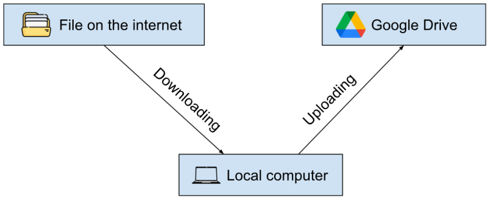
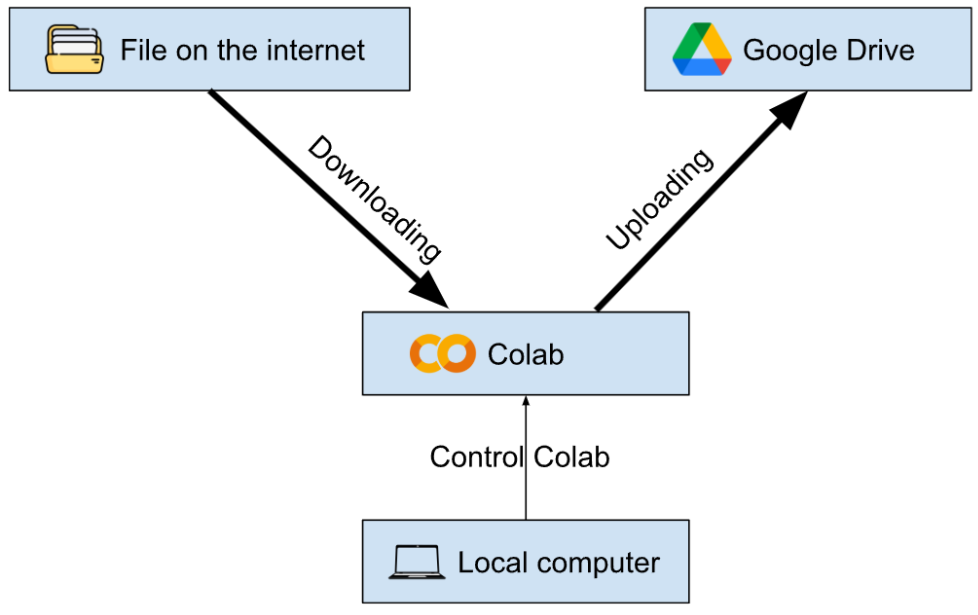

# colab-download-file-to-gdrive

Script to download large files from the internet to Google Driver, running on Colab.

## Overview

This is a simple script to download large files from the internet to Google Drive, running on Colab.

We want to copy a large file (100 GB) from the internet to Google Drive.

It takes many hours to download the file from the internet to the local computer, then upload to Google Drive.

Instead of downloading to a local computer then uploading to Google Drive, we will “copy” the file directly from the internet to Google Drive using Google Colab. By using Google's internet connection, this will make it faster than download to your own local computer.

* Normal way of downloading to a local computer then uploading to Google Drive (slow)
  
* Speedy way: using Colab for direct download (faster)
  

## Usage summary

1. Download [src/DownloadFileToGoogleDrive.ipynb](src/DownloadFileToGoogleDrive.ipynb) to your Colab or Google Drive.
2. Open the script in Colab.
3. Run the script, upload the download file list (in csv file) then wait until all files are downloaded to your Google Drive.

## Detailed steps

See [docs/ColabScirptManual/README.md](docs/ColabScirptManual/README.md)
