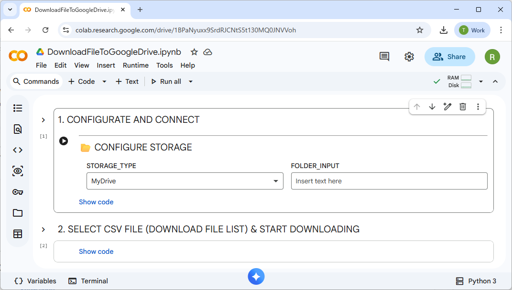
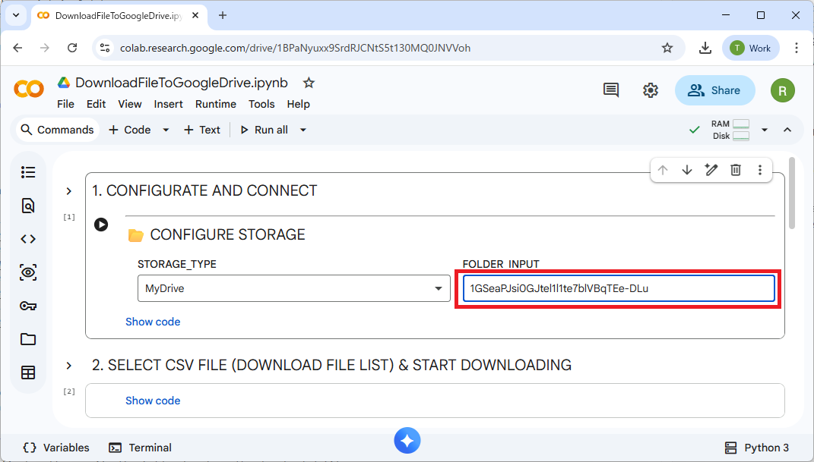
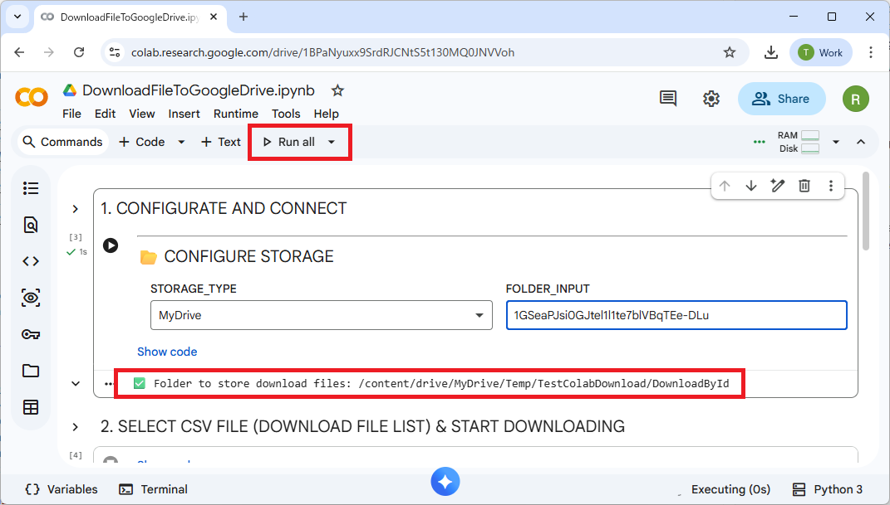
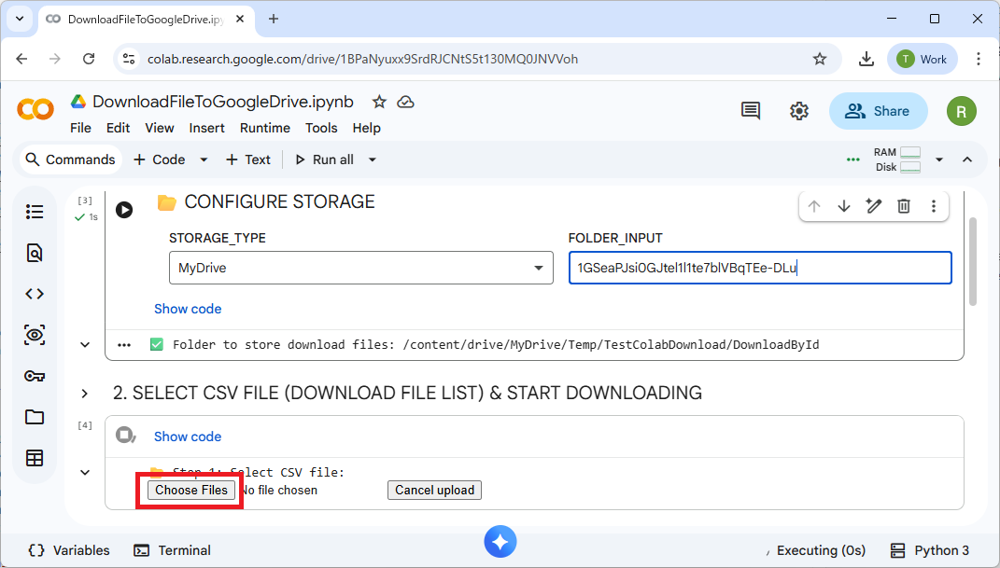
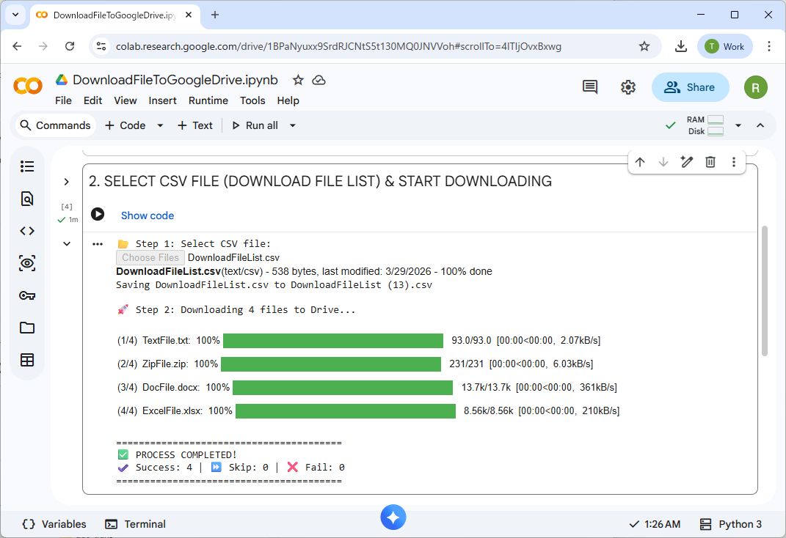
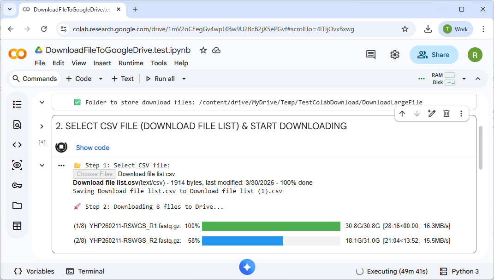

# Running Colab script

## Overview

This document describes how to run the Colab script [src/DownloadFileToGoogleDrive.ipynb](../../src/DownloadFileToGoogleDrive.ipynb) on your Google Colab.

The steps are as follows:

1. Preparation
2. Open the script in Colab.
3. Specify folder to store the downloaded files.
4. Run all
5. Upload the download file list (CSV).
6. Wait until all files are downloaded.

## Steps

### Preparation

* Create a CSV file with the following format, that contain the source URL and the FileName.
   You can see the sample [DownloadFileList.csv](../../../test/FileToDownload/DownloadFileList.csv)
* Download the file [DownloadFileToGoogleDrive.ipynb](../../src/DownloadFileToGoogleDrive.ipynb).

### Open the script in Colab

* Open https://colab.research.google.com/ on your web browser.
  Upload the file *DownloadFileToGoogleDrive.ipynb* or open it from Google Drive.
   
* Open the script in Colab.
   

### Specify folder to store the downloaded files

* In the first cell, specify the folder to store the downloaded files.
   * In STORAGE_TYPE, select "MyDrive" to save to your own Google Drive, or "Shared drivers" to save to a shared drive.
   * In FOLDER_INPUT, specify the path of the folder or folder ID
   
      * Example of path: /Temp/TestColabDownload/DownloadByFolder
      * Example of folder ID: 1GSeaPJsi0GJtel1l1te7blVBqTEe-DLu

### Run all

* Click "Run all" button to run all the cells.
* It will show the path of the folder
   

### Upload the download file list (CSV)

* In the second cell, click *Choose File* button and select the download file list (CSV).
   

### Wait until all files are downloaded

* Wait until all files are downloaded.
   
* It will take several hours to download large files.
   
