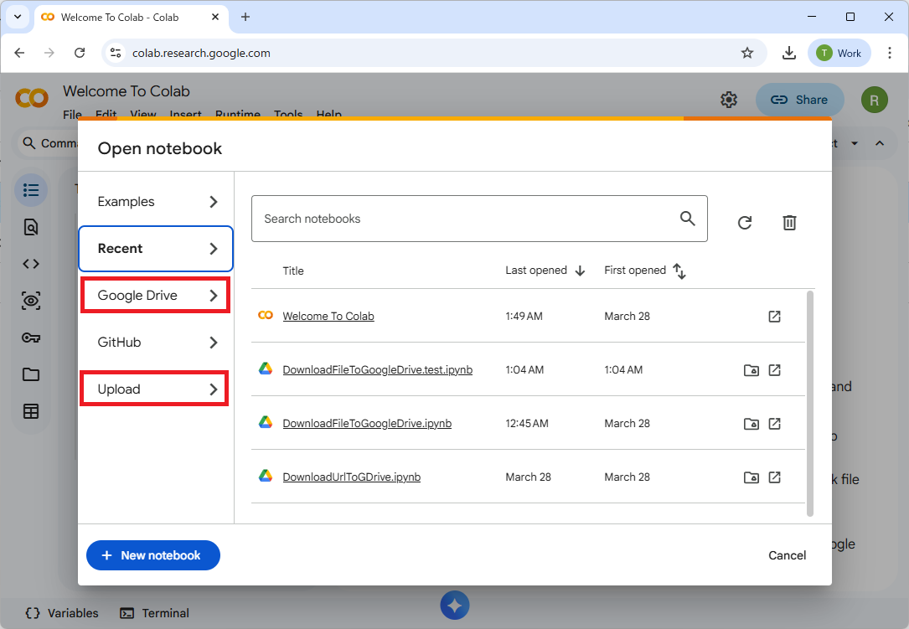
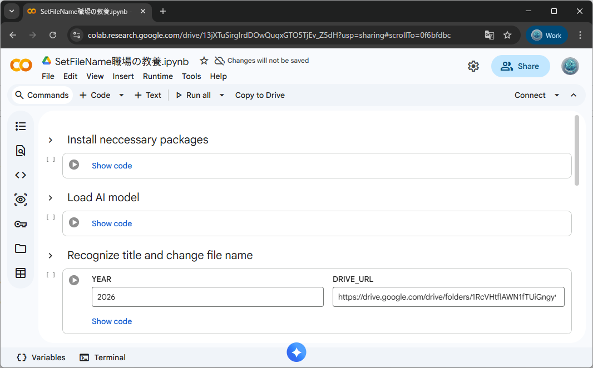
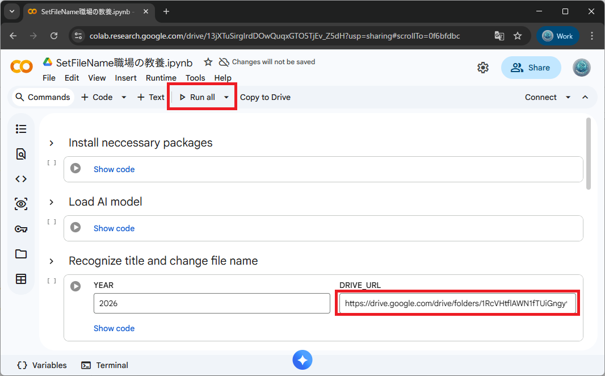
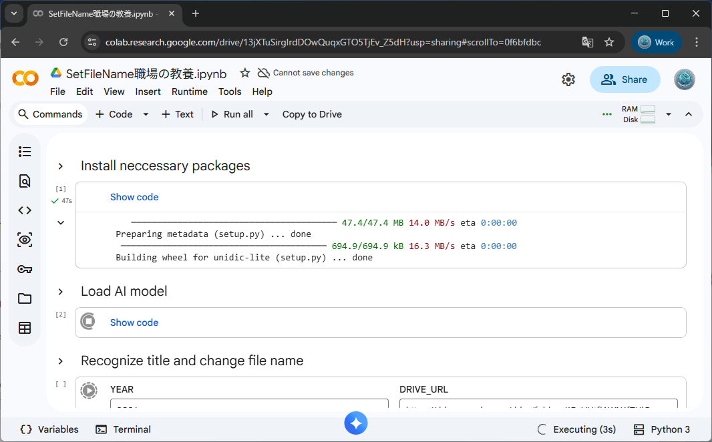
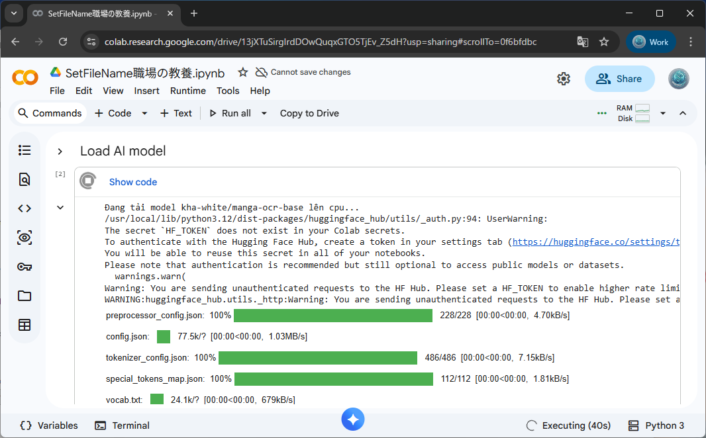
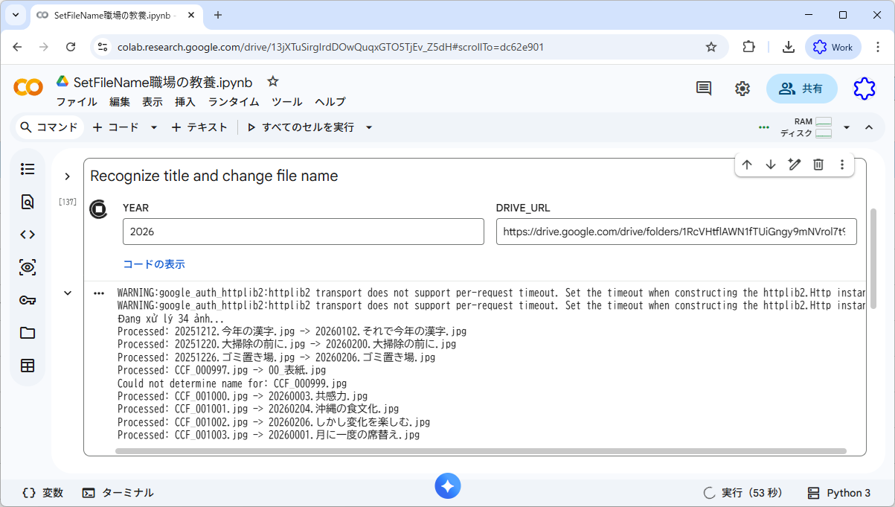
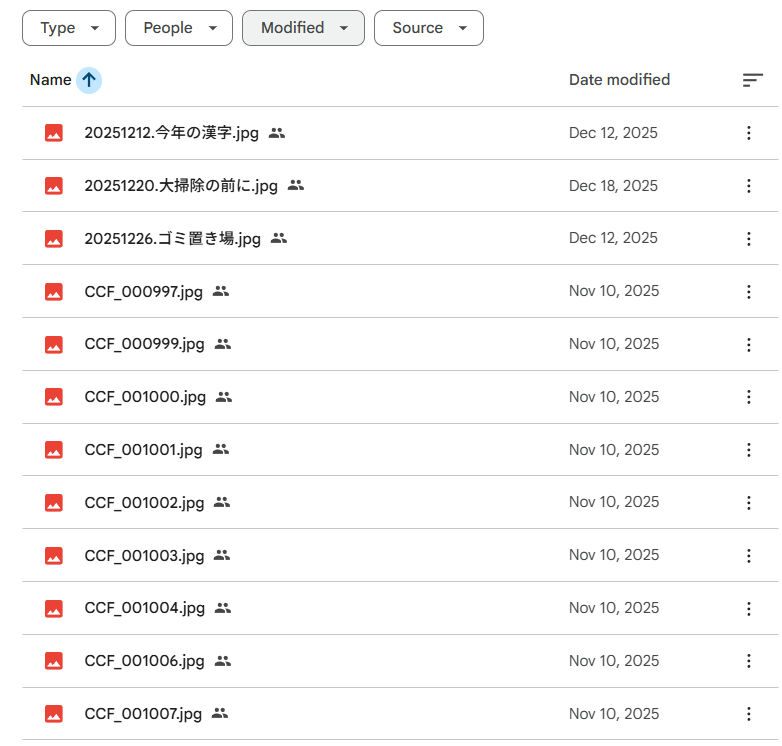
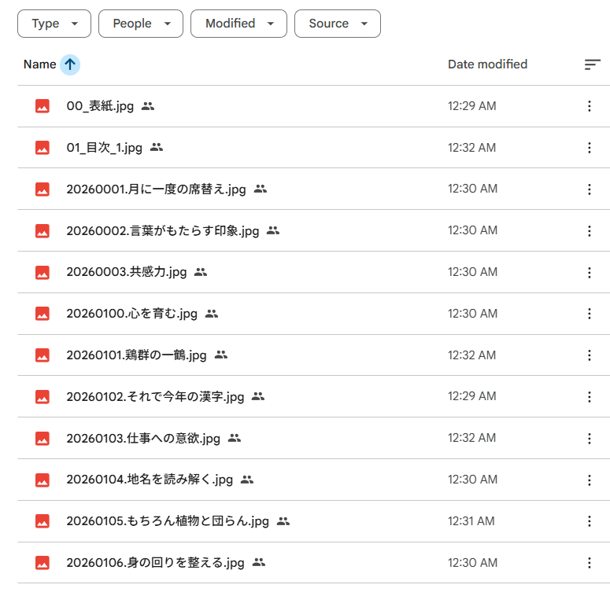

# Download file to Google Drive

## 1. Overview

[SetFileNameShokubaNoKyoyo.ipynb](SetFileNameShokubaNoKyoyo.ipynb) is a script to rename the scanned image files of 職場の教養 to the format of their date_title, running on Google Colab.

**Notice:** You must check the file name after rename. If the file name is not correct, you can rename it manually.

## 2. Usage summary

1. Download [SetFileNameShokubaNoKyoyo.ipynb](SetFileNameShokubaNoKyoyo.ipynb) to your Colab or Google Drive.
2. Open the script in Colab.
3. Run the script, specify the URL to the folder that contains the image files, run all the scripts and waint until it rename all the files.

Step to run this scripts:

1. Open the script in Colab.
2. Specify folder of image files.
3. Run all
4. Wait until all files are renamed.

## 3. Steps

### 3.1. Open the script in Colab

* Open https://colab.research.google.com/ on your web browser.
  Upload the file *SetFileNameShokubaNoKyoyo.ipynb* or open it from Google Drive.
  
* The script is opened.
  

### 3.2. Specify folder of image files.

* Specify the URL of Google Folder that contains image file.
  

### 3.3. Run all

* Click "Run all" button to run all the cells.
* It will install necessary python packages and load AI model.
  
  
* Then it will run the OCR and rename the files.
  

### 3.4. Wait until all files are rename

| Before rename                               | After rename                              |
| ------------------------------------------- | ----------------------------------------- |
|  |  |
